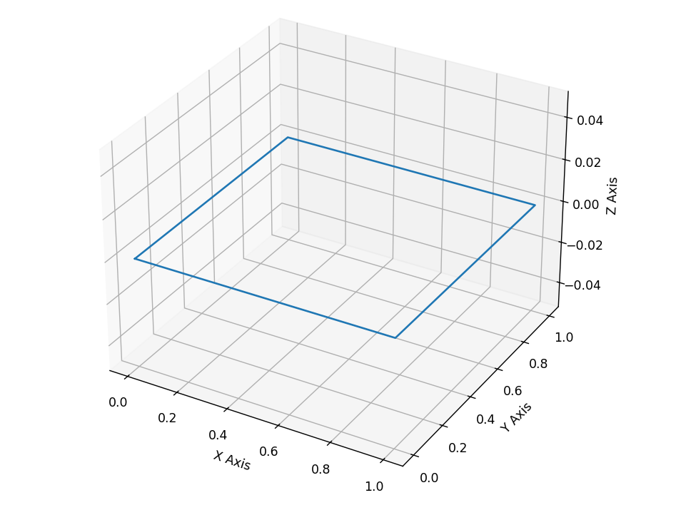
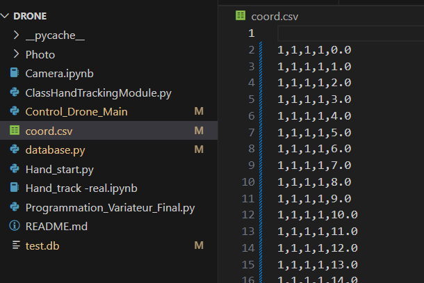
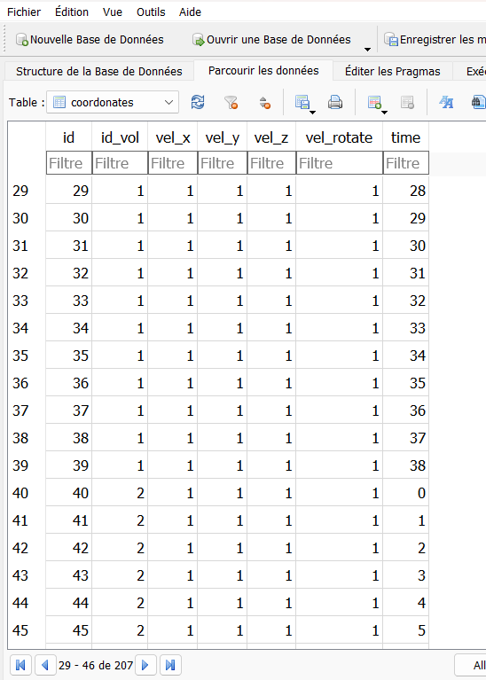

# Projet : Drone Kit Mains Libres

Le drone est piloté à l'aide de la main, via à une caméra.
Et montre en temps réel, le déplacement du drone sur une map 3D.


## Documentation

[Hand Tracking by Murtaza's Workshop - Robotics and AI ](https://www.youtube.com/watch?v=NZde8Xt78Iw)


[SQLite tutorial](https://www.sqlitetutorial.net)

[Downloads - DB Browser for SQLite](https://sqlitebrowser.org/dl/)


## FAQ

#### Question 1 : Comment faire fonctionner le drone ?

Ouvrire votre main sur le plan de la caméra

#### Question 2 : Comment stopper le robot ?

Fermer votre main sur le plan de la caméra

#### Question 3 : Comment avancer et reculer le drone ? 

Pour avancer : maintenez votre main en position ouverte et avance votre main sur le plan de la caméra

Pour reculer : maintenez votre main en position ouverte et reculer votre main sur le plan de la caméra

#### Question 4 : Comment piloter le drone de gauche à droite ? 

Bouger votre main (en position ouverte) de gauche à droite sur le plan de la caméra

#### Question 5 : Comment augmenter la hauteur du drone ?

Plier le majeur de votre main sur le plan de la caméra

#### Question 6 : Comment diminuer la hauteur du drone ? 

Plier l'index de votre main sur le plan de la caméra

#### Question 7 : Comment faire une rotation du drone ?

Faire une rotation de la main en horizontal sur le plan de la caméra

## Tracking drone

Le fichier Control_Drone_Main.py sert à piloter le drone en ayant un retour caméra sur l'écran afin de positionner sa main plus précisément et par conséquent, rendre le pilotage plus aisé.

Le fichier Control_Drone_Main2.py est un test d'implémentation de la sauvegarde de la base de donnée pendant et après un vol.

## Map 3D

La librairie "have_a_plot.py" permet d'affiché un rendue 3D en temps réel. Deux version de cette librairie sont disponible : 

"have_a_plot.py", qui se base sur les retour des capteurs du drone et est donc trés proche de la réalité, mais ne fonctionne pas avec toute les version du drone. Sa fonction "refresh_coo()" ne demande aucun parametre.

"have_a_plot_handV.py", qui se base sur le commande envoyé au drone pou affiché le 3D, et est donc moins proche de la réalité que "have_a_plot.py", mais fonctionne avec toutes les version du drone. Sa fonction "refresh_coo()" prend la position x, y et z en parametres.

Les etapes sont decrite en utlisant "have_a_plot_handV" as "HPH". 

Etape 0 :
  Importer la librairy de votre choix : 
    ```import have_a_plot.py as HP```
                ou
    ```import have_a_plot_handV.py as HPH"```
    
Etape 1 : 
  Initializé les variable intern avec : 
  ```HPH.init()```
  
Etape 2 :
  Lancer la vue 3D avec la fonction :
  ```have_a_plot.plot_the_3D()```

Etape 3 : 
  Actualizez les coordoné aprés chaque commande de mouvement :
  ```refresh_coo(x, y, z)```

Etape 4 :
  En fin de programme, fermé les processus : 
  ```HPH.end()```




## Database
L'objectif de la base de donnée est de récuperer les données de vol du drone pour les stocker. On pourra par la suite les utiliser pour refaire le parcours sauvegardé.

La capture des données se fait tout d'abord en local, en utilisant un fichier .csv. Puis, une fois le vol terminé, les données sont stoquées dans la base de données.
Le fichier database.py permet de réaliser les tests unitaires des fonctions utilisant notre base de données (test.db).

Sur les images suivantes on voit les valeurs de test enregistré dans le fichier csv (en local) ainsi que dans la base de données.



## Running Tests

To run tests, run the following command

```bash
  python .\Control_Drone_Main
```


## Demonstration


## Future optimization
 
